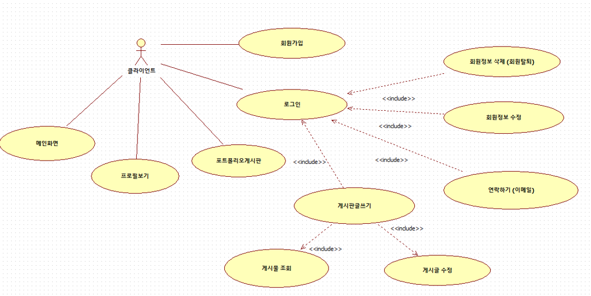

# 개인 포트폴리오 홈페이지（個人 ポートフォリオ ホームページ）

 

JSP를 활용한 자기소개 홈페이지（JSPで作った自己紹介ホームページ）

# 1. 개발환경 (開発環境)

•Windows 10

•MySQL 5.7

•JDK 1.8

•Tomcat 8.0

•Eclipse EE

•HTML5

•CSS3

•JavaScript

•JSP

# 2. UML 설계 (UML設計)

# 3. DB 설계 （データベース設計）

# 4. 클래스 다이어그램 ( Class Diagram)

# 5. 구현모습 （スクリーンショット）

